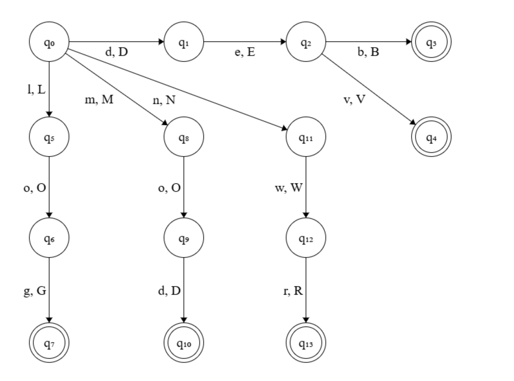

# Command Finite State Machine


## 1. Description


This file documents implementation details of each part of **FSM** (**finite state machine**) for **command interpreter**. This FSM helps in recommending user right flag for a mistake, and developers to add more flags by simply adding more states.


## 2. Representation


### 2.1 <u>State Diagram</u>:




### 2.2 <u>Central Function</u>:

```c
void cmd_fsm_main(char *str, unsigned short int start, char *mode);
```

- `N` - A whole number representing a part of FSM, each part containing 10 states.
- `str` - String which is passed to the FSM.
- `start` - Index of string to start running machine.
- `state` - Initial state of the machine.


### 2.3 <u>Part Function</u>:

```c
void cmd_fsmN(char *str, unsigned short int start, signed short int *state);
```

- `N` - A whole number representing a part of FSM, each part containing 10 states.
- `str` - String which is passed to the FSM.
- `start` - Index of string to start running machine.
- `state` - Initial state of the machine.


### 2.4 <u>Details</u>:

- All parts of FSM are assembled at central FSM assembly point.
- Central assembler runs on endless loop & switch-cases within which tell which part of FSM to jump in.
- Initially, machine starts with 0th index of string & state `0`.
- The central FSM handler uses formula `state/10` to get the case for next iteration.
- Central FSM stores the global details like state.


### 2.5 <u>Steps (Central FSM)</u>:

1. Check if the mode passed is valid or not, proceed if valid or halt otherwise.
2. Until the string hasn't been read completely, or no mistake is found, keep reading each char.
3. Use the formula `state/10` to know which part of FSM to run.
4. For an invalid state, display error on screen.
5. Also displays message/diagnosis for unknown state.


### 2.6 <u>Steps (Part of FSM)</u>:

1. Check if the mode passed is valid or not, proceed if valid or halt otherwise.
2. Change state as per the read symbol (char).

---