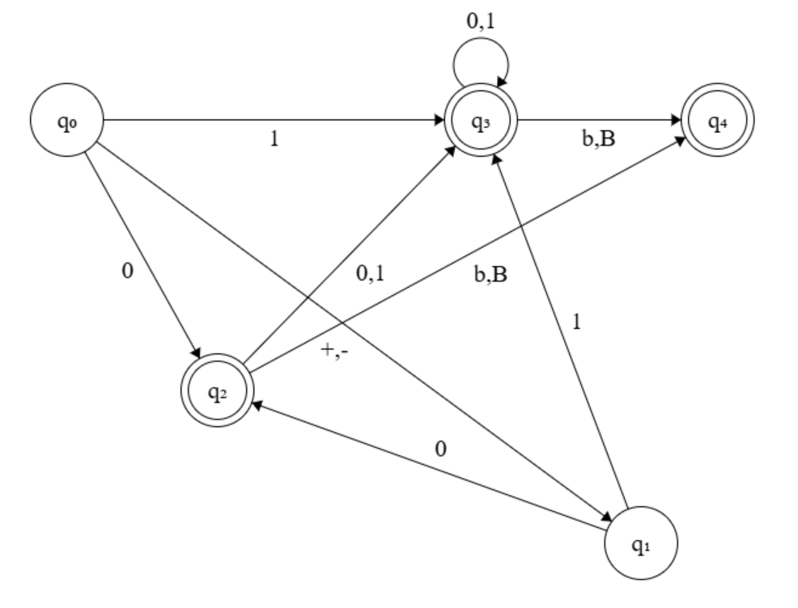
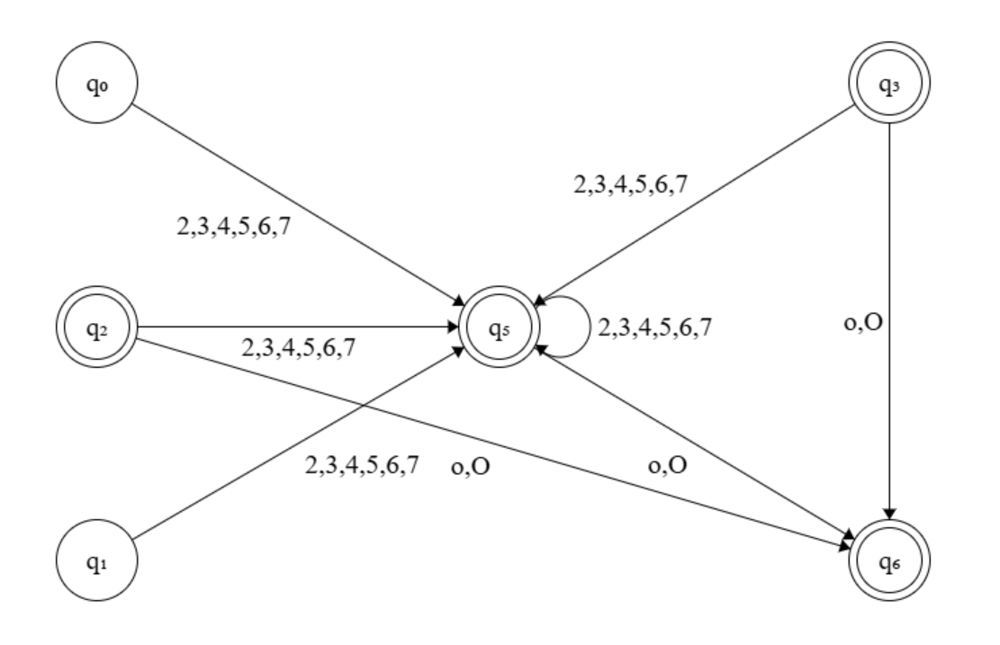
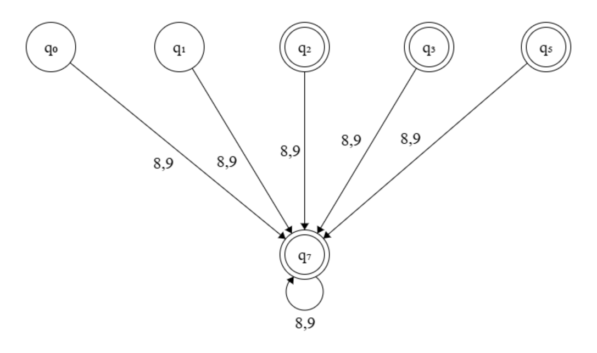
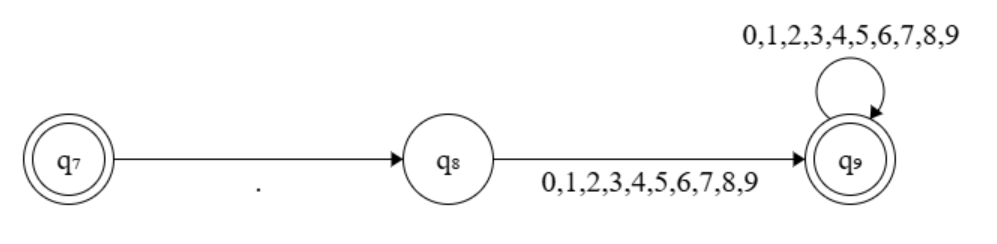
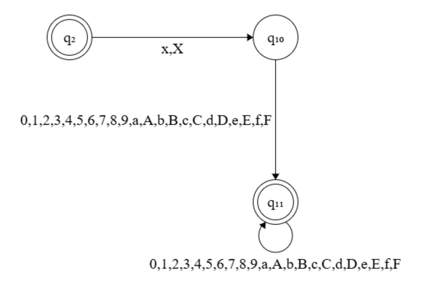
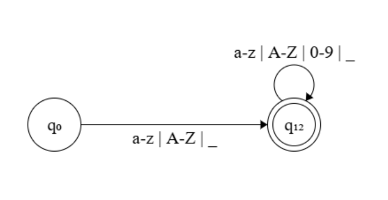
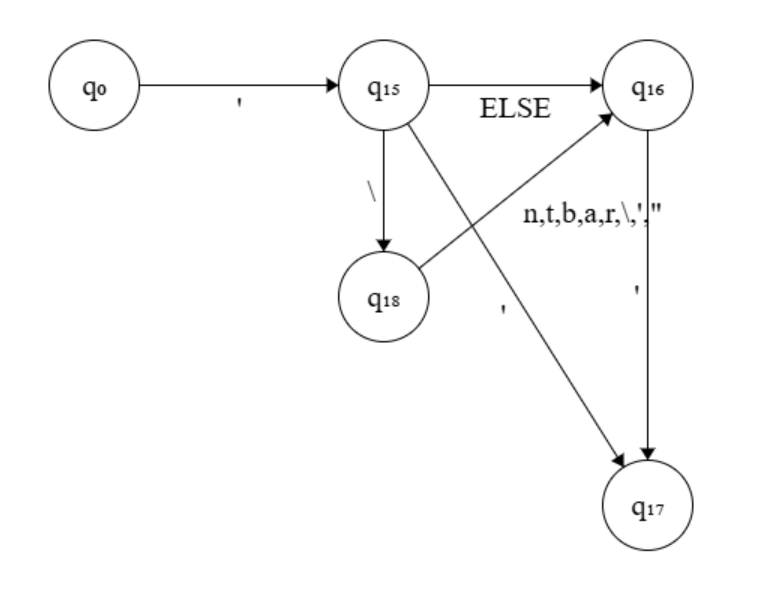
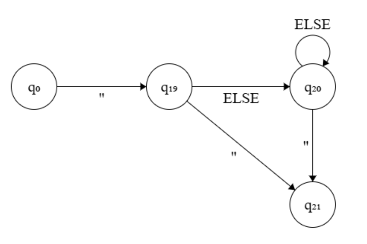

# UNKNOWN TOKEN FINITE STATE MACHINE


## 1. Description


This file explains implementation of **finite state machine** for categorizing unknown tokens.


## 2. State Diagrams


### 2.1 <u>Categories</u>:

- Binary number
- Octal number
- Decimal number
- Float
- Hex number
- Identifier name


### 2.2 <u>Diagrams</u>:












## 3. Algorithm


### 3.1 <u>Central Function</u>:

```c
bool token_fsm_main(char *str, unsigned short int start, char *mode);
```

- `N` - A whole number representing a part of FSM, each part containing 10 states.
- `str` - String which is passed to the FSM.
- `start` - Index of string to start running machine.
- `state` - Initial state of the machine.
- `point` - Point in line from where the message has to be called out.
- `row` - Current row in the stage.
- `column` - Current column in the stage.
- `mode` - Programmer chosen mode for feedback.


### 3.2 <u>Part Function</u>:

```c
void token_fsmN(char *str, unsigned short int start, signed short int *state);
```

- `N` - A whole number representing a part of FSM, each part containing 10 states.
- `str` - String which is passed to the FSM.
- `start` - Index of string to start running machine.
- `state` - Initial state of the machine.


### 3.3 <u>Steps (Central FSM)</u>:

1. Check if the mode passed is valid or not, proceed if valid or halt otherwise.
2. Until the string hasn't been read completely, or no mistake is found, keep reading each char.
3. Use the formula `state/10` to know which part of FSM to run.
4. For an invalid state, display error on screen.
5. Also displays message/diagnosis for unknown state.


### 3.4 <u>Steps (Part of FSM)</u>:

1. Check if the mode passed is valid or not, proceed if valid or halt otherwise.
2. Change state as per the read symbol (char).


## 4. Details

- Vacant states: `13`
- All parts of FSM are assembled at central FSM assembly point.
- Central assembler runs on endless loop & switch-cases within which tell which part of FSM to jump in.
- Initially, machine starts with 0th index of string & state `0`.
- The central FSM handler uses formula `state/10` to get the case for next iteration.
- Central FSM stores the global details like state.

---