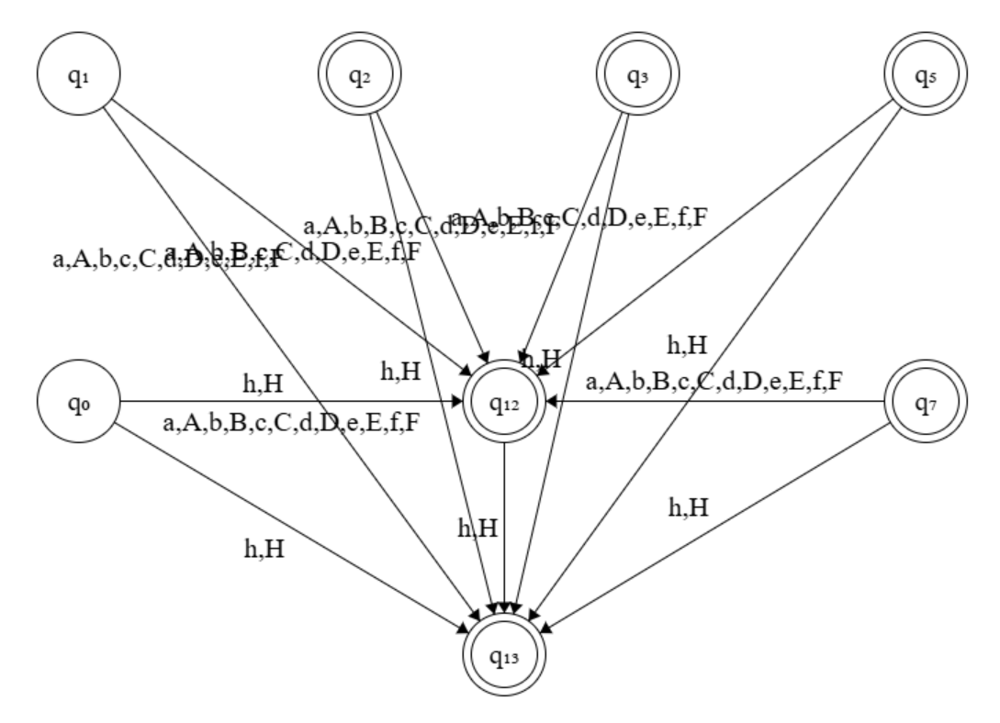

# UNKNOWN TOKEN FINITE STATE MACHINE


## 1. Description


This file explains implementation of **finite state machine** for categorizing unknown tokens.


## 2. State Diagrams


### 2.1 <u>Categories</u>:

- Binary number
- Octal number
- Decimal number
- Float
- Hex number
- Identifier name


### 2.2 <u>Diagrams</u>:





## 3. Algorithm


### 3.1 <u>Functions</u>:

```c
short int token_fsm(char *str, char *mode);
```

- `str` - String to be scanned by FSM.
- `mode` - Mode requested by programmer.


### 3.2 <u>Steps</u>:

1. Whole string is scanned as a tape in loop for each character.
2. The stop state is returned.


### 3.3 <u>Time Complexity</u>:

- **Best case -** $O(1)$ due to return at first encounter itself (if found at 0th index).
- **Average case -** $O(n.m)$ for matching each character of target string with illegal character set.
- **Worst case -** $O(n.m)$ Same reason as for the **average case**.

---