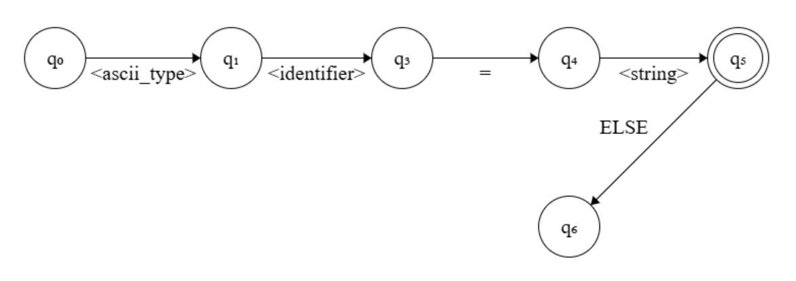

# PARSER FINITE STATE MACHINE


## 1. Description


This file records the implementation of **parser finite state machine** which parses the assembly instructions, calls binary generator components, then directs the end result to the state handler.


## 2. Algorithm


### 2.1 <u>Functions</u>:

#### 2.1.1 FSM PARTS:-
```c
void parser_fsmN(uintptr_t *sec_ptr, long int sec_block_count, unsigned int start, signed int *state);
```

- `sec_ptr` - Passed pointer to section's start in linked list.
- `sec_block_count` - Total number of blocks that the section contains.
- `start` - Particular state to continue from.
- `state` - Shared variable for state transition.

#### 2.1.2 MAIN FSM:-
```c
bool parser_fsm_main(uintptr_t *sec_ptr, long int sec_block_count, unsigned int start, char *mode);
```

- `sec_ptr` - Passed pointer to section's start in linked list.
- `sec_block_count` - Total number of blocks that the section contains.
- `start` - Particular state to continue from.
- `mode` - Mode chosen for providing feedback.


## 3. Side Notes


### 3.1 <u>Parts Of ELF Object</u>:

- ELF header
- Section header
- Section data
- String tables


### 3.2 <u>GNU Section Ordering</u>:

- `NULL` (index `0`)
- `.text`
- `.rela.text`
- `.data`
- `.bss`
- `.rodata`
- `.symtab`
- `.strtab`
- `.shstrtab`
- `.comment`
- `.note.GNU-stack`
- `.debug_*` (index `11`)


### 3.3 <u>Parsing Verification Checks</u>:

1. **Correctness**
2. **Availability**
3. **Position**
4. **Legality**


## 4. Finite State Machine


### 4.1 <u>ASCII Type</u>:

```asm
<ascii_type> <label> = "value"    ; ASCII label
```



---