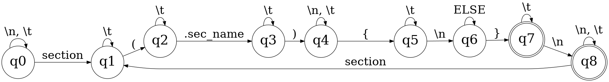

# PATTERN FINDER


## 1. Description


This file records the implementation of **pattern finder**, which looks for section blocks & marks their starting & ending (for each instance) as checkpoint.


## 2. Algorithm


### 2.1 <u>Functions</u>:

#### 2.1.1 FSM PARTS:-
```c
void patt_fsmN(Ll_node *token_ptr, Ll_node *categ_ptr, Ll_node *subcateg_ptr, Ll_node *type_ptr,
	unsigned short int start, signed short int *state);
```

- `token` - Current node in iteration of token's linked list.
- `categ` - Current node in iteration of category's linked list.
- `subcateg` - Current node in iteration of sub-category's linked list.
- `type` - Current node in iteration of type's linked list.
- `start` - Particular state to continue from.
- `state` - Shared variable for state transition.

#### 2.1.2 MAIN FSM:-
```c
bool patt_fsm_main(Ll_node *token_ptr, Ll_node *categ_ptr, Ll_node *subcateg_ptr, Ll_node *type_ptr,
	unsigned short int start, char *mode);
```

- `token` - Current node in iteration of token's linked list.
- `categ` - Current node in iteration of category's linked list.
- `subcateg` - Current node in iteration of sub-category's linked list.
- `type` - Current node in iteration of type's linked list.
- `start` - Particular state to continue from.
- `mode` - Mode chosen for providing feedback.


### 2.2 <u>Pattern To Find</u>:

```asm
section(.sec_name) {
	; Code
}
```

1. Start iterating over the involved linked lists.
2. For each new node being scanned, do the following.
3. Pass it through the pattern finding FSM for verification.
4. If the FSM at the end of scanning reaches unacceptable state, show error.
5. Save the opening & closing for each section.
6. For having no `.text` section at all, show a warning.


## 3. Finite State Machine Information


### 3.1 <u>State Diagram</u>:



---