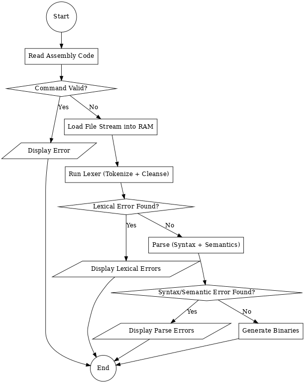

# MACRO-LEVEL WORKING

## 1. Description

This file explains the flow of assembler's working along from a top view, or as a bigger (macro) picture.

## 2. Stepwise Flow

1. Assembling of the source assembly code.
2. Check & display for any error or ambiguity in command.
3. For error free command, load the file stream into RAM.
4. Run lexer to fetch all the tokens from code while parallelly cleansing.
5. For any error or ambiguity, display everything on the terminal.
6. For successful extract, parse the code for logic & semantic consistency.
7. For any error or ambiguity, display everything on the terminal.
8. If successful, now as per the mode, generate binaries for that code.

## 3. Graphical Representation

## 4. Involved Components

- Command interpreter
- File stream loader
- Lexer
- Parser
- Binary generator

---