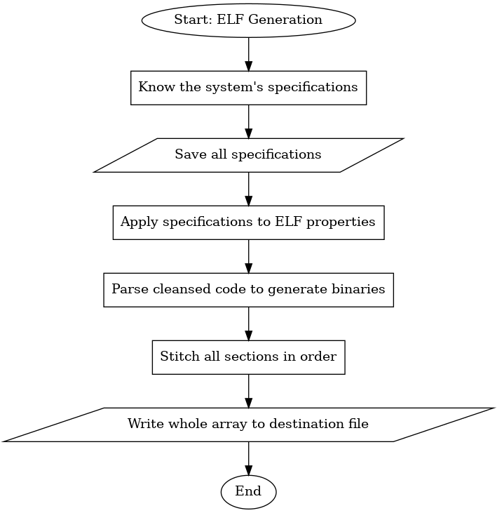

# BINARY GENERATOR

## 1. Description

This file explains working of the **binary generator** at a micro-level, with its sub-components.

## 2. Stepwise Flow

1. Know the system's specifications.
2. Save all specifications somewhere.
3. Use these specifications on the ELF properties.
4. Again parse the cleansed code to generate binaries.
5. Stitch all sections in order.
6. Write whole array to the destination file.

## 3. Graphical Representation

## 4. Involved Sub-Components

- Specs extractor
- Specs storehouse
- Specs assigner
- Generating parser
- Sections merger (different from **section merger**)
- RAM to disk writer

---