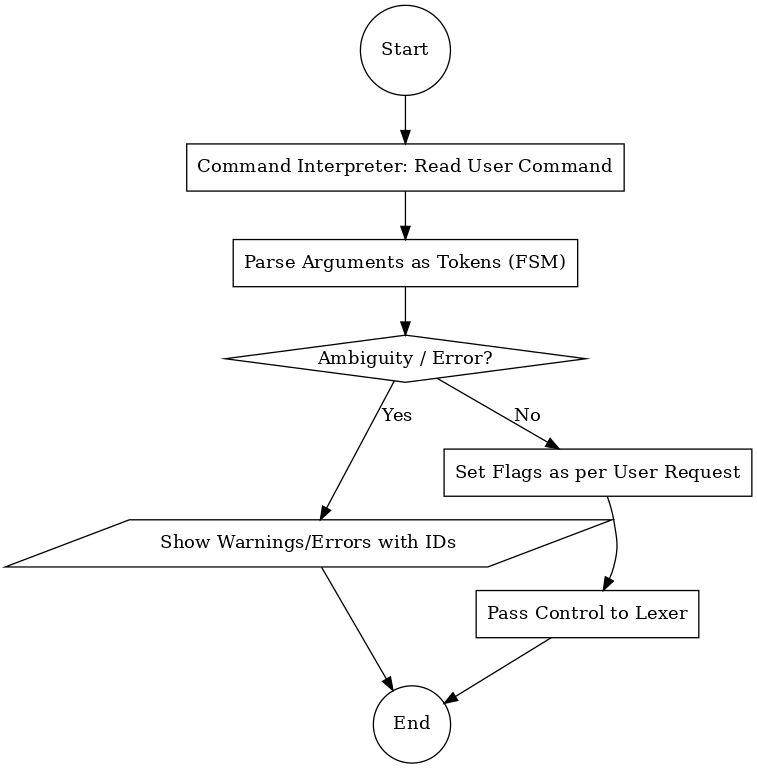

# COMMAND INTERPRETER

## 1. Description

This file explains working of the **command interpreter** at a micro-level, with its sub-components.

## 2. Stepwise Flow

1. Command interpreter takes in the user command in form of arguments.
2. These arguments are used as tokens themselves & validated as per their ordering.
3. Warnings or errors might appear, which are trapped by ambiguity handler.
4. These ambiguities are shown with their IDs for troubleshooting.
5. If no error is faced, the flow continues further.
6. Various flags are set as per the user's request.
7. Then control is passed to the lexer.

## 3. Graphical Representation

>**<u>NOTE</u>:**
> - Only ambiguity that stops the process is error, not warning.
> - Then the control is passed to filestream loader, not the lexer.

## 4. Involved Sub-Components

- Command validator
- Command error log
- Command warning log
- Request flag statuses

---
