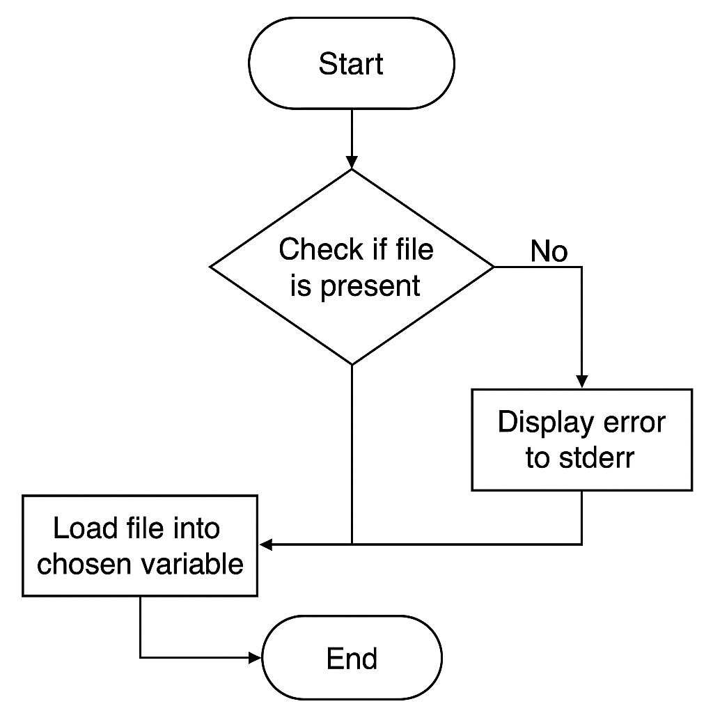

# DISK TO RAM LOADER

## 1. Description

This file explains working of the **filestream loader** at a micro-level, with its sub-components.

## 2. Stepwise Flow

1. Checks if the file is present or not again.
2. If not present, displays `stderr` for the same.
3. If present, loads the filestream into a chosen variable.

## 3. Graphical Representation

## 4. Involved Sub-Components

- Filestream loader

---