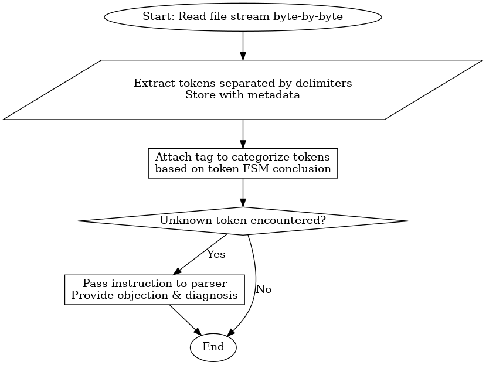

# LEXER

## 1. Description

This file explains working of the **lexer** at a micro-level, with its sub-components.

## 2. Stepwise Flow

1. Lexer reads the filestream byte-by-byte.
2. Tokens seperated by delimeters are extracted & stored in a structure with their respective metadata.
3. We attach a tag to categorise & sub-categorise tokens as per the conclusion token-FSM reaches.
4. If an unknown token is faced, that particular instruction is parsed by parser to provide clear objection & diagnosis.

## 3. Graphical Representation

## 4. Involved Sub-Components

- Tokenizer
- Token FSM
- Token storehouse
- Lexical error log
- Lexical warning log

---