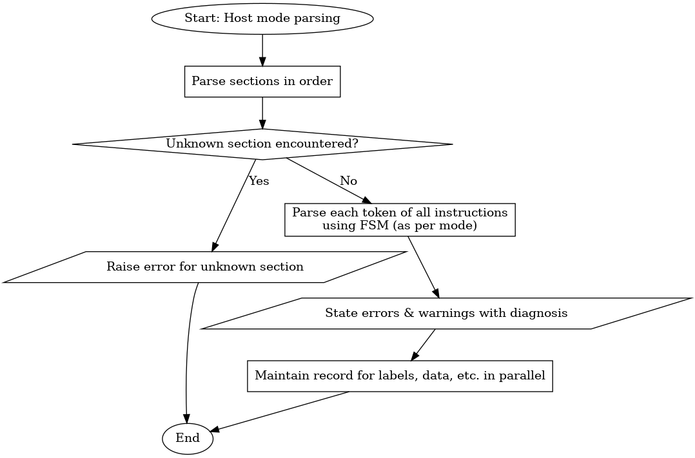

# PARSER

## 1. Description

This file explains working of the **parser** at a micro-level, with its sub-components.

## 2. Stepwise Flow

1. For host mode, parse in order of sections.
2. Catch it as error if any unknown section is found.
3. Parse each token of all instructions with FSM (as per mode).
4. State errors & warnings when they are faced, with diagnosis.
5. Keep parallely storing/maintaining record for labels, data, etc.

## 3. Graphical Representation

## 4. Involved Sub-Components

- Stream pattern finder
- Section merger
- Parser FSM
- Parsing error log
- Parsing warning log
- Register storehouse
- Section storehouse
- Label storehouse

---